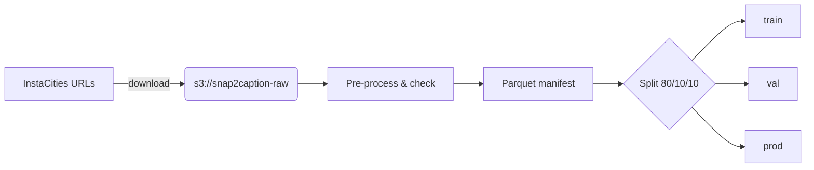

# Snap2Caption

> *Turn any Instagram photo into a scroll‑stopping post, complete with a tailored caption and trending hashtags, in under two seconds.*

---

## Meet **Aisha**, Our Customer  *(Unit 1 – Value Proposition)*

Aisha is a solo lifestyle creator who posts colourful city snapshots every evening after work.  She loves sharing, hates word‑smithing, and checks insights obsessively.  Snap2Caption exists for creators like her: upload a photo, get a punchy caption in her voice plus hashtags tuned to what’s hot **right now**.  To delight Aisha we committed to:

* **Zero friction** → a single `/generate-caption` call that runs anywhere she can curl.
* **Timely trend awareness** → overnight re‑training so the hashtag list mirrors today’s conversations.
* **Mobile‑first speed** → P90 latency < 2 s so she can post while her coffee is still hot.

Those promises ripple through every design choice that follows.

---

## From Pixels to Parquet — **Data Foundations**  *(Unit 8)*

Our journey starts with **InstaCities1M** (≈ 50 GB).  A nightly ETL job – [`pipelines/data_ingest.py`](./pipelines/data_ingest.py) – fetches fresh URLs, validates JPEGs, and writes them to an S3‑compatible bucket provisioned in [`infra/terraform/storage.tf`](./infra/terraform/storage.tf).  A companion script, [`pipelines/preprocess.py`](./pipelines/preprocess.py), resizes each image to `300×300`, wraps it in our chat template, and records the result in Parquet.



Persistent volumes:

| Mount                          | Purpose                   | Size  | Kind            |
| ------------------------------ | ------------------------- | ----- | --------------- |
| `/mnt/object/snap2caption-raw` | Raw & processed images    | 50 GB | Object store    |
| `/mnt/block/checkpoints`       | Model & tokenizer weights | 25 GB | Rook‑Ceph block |
| `/mnt/block/experiments`       | Weights & Biases cache    | 10 GB | Block           |

Online, every inference request and user rating flows through [`schemas/online_event.avsc`](./schemas/online_event.avsc) into Kafka, lands in `/mnt/block/online_events`, and is swept nightly by [`pipelines/online_consumer.py`](./pipelines/online_consumer.py).  A Spark job joins these logs with engagement metrics, computes KL‑drift; when drift > 0.15, Prometheus fires an alert that kicks off re‑training.

---

## Teaching the Model — **Training & Experimentation**  *(Units 4 & 5)*

Captions are natural language; hashtags are ranked keyword strings.  We frame this as *image‑conditioned sequence generation* and fine‑tune **LLaVA‑1.5‑7B** with rank‑16 LoRA adapters.

* Training entry‑point: [`src/train/train.py`](./src/train/train.py)
* Distributed engine (DDP + FP16): [`src/train/engine.py`](./src/train/engine.py)
* Weekly scheduled job: [`k8s/cron_retrain.yaml`](./k8s/cron_retrain.yaml)

> **Result:**  DDP slashed wall‑clock from 8 h to **5 h** on 4× A100‑80G while BLEU‑4 climbed to **0.31**.

Experiments are logged to MLflow (run `make mlflow-ui`), artefacts live under [`mlruns/`](./mlruns).

---

## Shipping Intelligence — **Infrastructure & Continuous Delivery**  *(Units 2 & 3)*

Aisha need never see our plumbing, but reliability starts here.


Everything is code:

| Layer                                        | Repo Path                                                      |
| -------------------------------------------- | -------------------------------------------------------------- |
| Terraform modules                            | [`infra/terraform`](./infra/terraform)                         |
| Helm chart                                   | [`infra/helm`](./infra/helm)                                   |
| Raw k8s resources (CronJobs, HPAs, Rollouts) | [`k8s/`](./k8s)                                                |
| Argo CD bootstrap                            | [`infra/argocd_bootstrap.yaml`](./infra/argocd_bootstrap.yaml) |

GitHub Actions workflow [`.github/workflows/pipeline.yaml`](./.github/workflows/pipeline.yaml) builds and pushes every commit, then Argo CD syncs **staging**.  Promotion to **canary** and finally **prod** is governed by Argo Rollouts (`k8s/rollout.yaml`).  The same pipeline restarts when a drift alert creates a GitHub Release, ensuring model, serving image, and manifests march forward together.

Deploying on **Chameleon Cloud** is a three‑step tale:

```bash
# 1. spin up GPU k8s and storage
make chi-init && make chi-apply

# 2. bootstrap Argo CD & let it deploy the chart
make argocd-bootstrap

# 3. watch the rollout, then fire a test call
make argocd-watch &
python demo_request.py sample.jpg
```

---

## Serving the Magic — **Real‑time Inference & Evaluation**  *(Units 6 & 7)*

The FastAPI server in [`src/serve/app.py`](./src/serve/app.py) loads an ONNX‑exported, 8‑bit‑quantised checkpoint (`scripts/convert_to_onnx.py`).  Images stream through a turbo‑JPEG decoder (`src/serve/decoder.py`) before tokenisation.  KEDA watches request count and scales the deployment (`k8s/keda_scaledobject.yaml`) from 0 to 10 replicas.

```text
POST /generate-caption
{ "image_base64": "…" }
→ { "caption": "Golden hour coffee vibes ☕🌇", "hashtags": ["#citysunset", …] }
```

Quality & reliability are gate‑checked by:

* **Offline tests** – [`tests/offline`](./tests/offline): run `pytest -q`
* **Load tests** – [`tests/load/locustfile.py`](./tests/load/locustfile.py): run `make load-test`
* **Dashboards & alerts** – Grafana JSON in [`docs/grafana`](./docs/grafana); alert rules in [`k8s/alerts.yaml`](./k8s/alerts.yaml)

Aisha’s optional thumbs‑up/down hits [`src/serve/feedback.py`](./src/serve/feedback.py); the rating joins the online log, nudging the next training set toward what *she* likes.

---

## Repository Atlas

| Folder       | What you’ll find                         |
| ------------ | ---------------------------------------- |
| `infra/`     | Terraform, Helm, Argocd bootstrap        |
| `k8s/`       | CronJobs, HPAs, Rollouts, alerting       |
| `pipelines/` | Data ingest, preprocess, online consumer |
| `src/train/` | Training & experimentation code          |
| `src/serve/` | Inference service & helpers              |
| `tests/`     | Offline unit + load tests                |
| `docs/`      | Diagrams, Grafana dashboards             |

---

## Local Taste Test

```bash
make docker-build
make docker-run
python demo_request.py sample.jpg
```

---

## License

MIT
